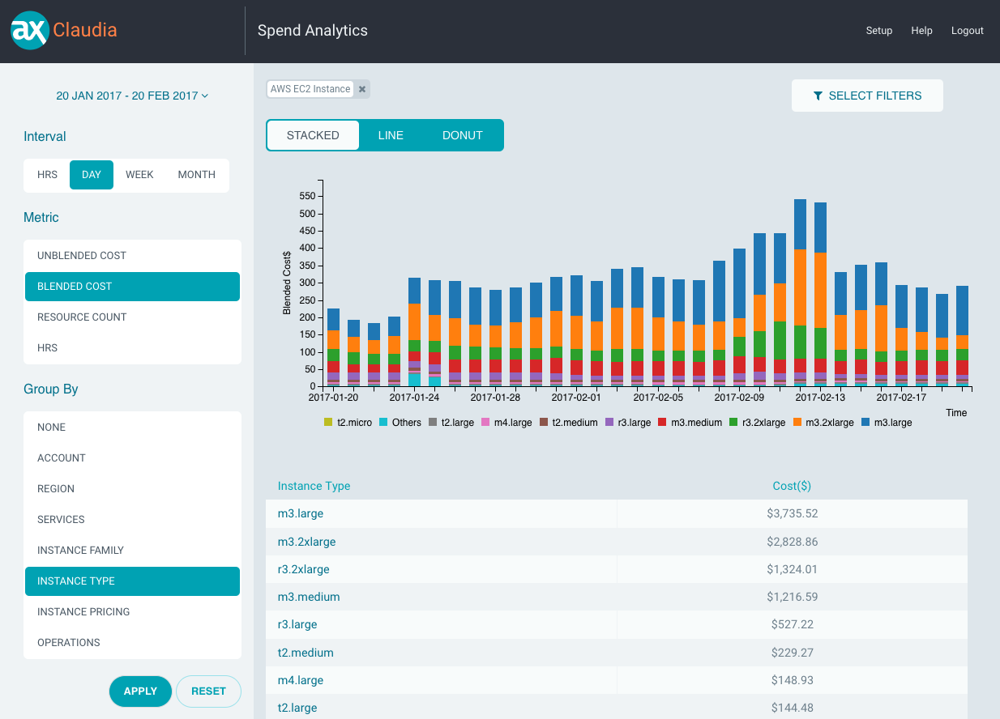

# Claudia

Claudia is a free and open source cost and usage analytics solution that provides insights into your AWS cloud spending.



# Installation

Official Claudia releases are made available as freely available AMIs on the AWS Marketplace. Visit the [Claudia marketplace page](https://aws.amazon.com/marketplace/pp/B06XVZ9VS9) to launch a Claudia instance in your account.

# Setup

Login with the username `admin` and the EC2 instance ID as the password. Follow setup instructions at [https://applatix.github.io/claudia](https://applatix.github.io/claudia).

# Building

### Requirements
 * docker
 * python
 * packer (for building AMI)

### Build Claudia Container Image
Builds the claudia container image (default: `claudia:latest`)
```
./build.py
```

### Build AMI
Build an AMI image based on the local claudia container image (default: `claudia:latest`).
```
./build.py -c ami --aws-profile <profile_name>
```

# Developing

### Running Locally

After building the the container, run:

```
docker-compose up
```

Visit [https://localhost](https://localhost) to access the app.

### Running in debug mode

```
docker-compose -f docker-compose-debug.yml up
```

Debug mode will:

 * Enable InfluxDB's admin interface
 * Expose the following ports:
   * Postgres 5432
   * InfluxDB 8086
   * InfluxDB admin UI 8083
   * ingestd 8081
   * claudiad 80/443
 * Leave the claudia container running in the event that the process dies, for the purpose of bashing into the container to restart the process manually or inspect any files.


### Running in development mode

```
docker-compose -f docker-compose-dev.yml up
```

Development mode starts only the database containers (postgres and influxdb) and exposes their ports. This mode allows you to run ingestd and claudiad manually (e.g. `go run`) and connect to localhost IP addresses.

To run ingestd manually, and connect it to the localhost postgres and influxdb:

```
USERDB_HOST=localhost:5432 POSTGRES_DB=userdb POSTGRES_PASSWORD=my-secret-pw go run ingestd/main.go run --reportDir /tmp/claudia --costdb http://localhost:8086
```

To run claudiad manually, connect it to the localhost postgres, influxdb, and ingestd, while also disabling SSL and running it on a different port (8080):

```
USERDB_HOST=localhost:5432 POSTGRES_DB=userdb POSTGRES_PASSWORD=my-secret-pw go run claudiad/main.go --costdbURL http://localhost:8086 --ingestdURL http://localhost:8081 --assets ./ui/dist/ --insecure --port 8080
```

# Documentation

The documentation site is built using [MkDocs](http://www.mkdocs.org/), a static site generator that creates static documentation from markdown files.

### Requirements
```
pip install mkdocs mkdocs-bootswatch
```

### Editing and previewing changes

Edit `mkdocs.yml` to change layout, headers, theme and other global settings. Edit markdown files under the `docs` directory to update and add new content.

Run the mkdocs server and visit [http://localhost:8000](http://localhost:8000) to preview your changes.

```
mkdocs serve
```

### Publishing

Run `mkdocs gh-deploy` to generate the static HTML and automatically push the contents into the `gh-pages` branch to reflect on the [Claudia project page](https://applatix.github.io/claudia).
```
mkdocs gh-deploy
```
