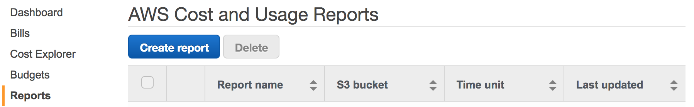
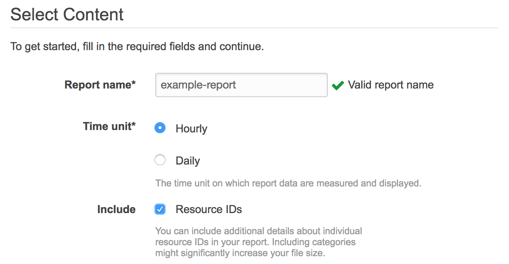
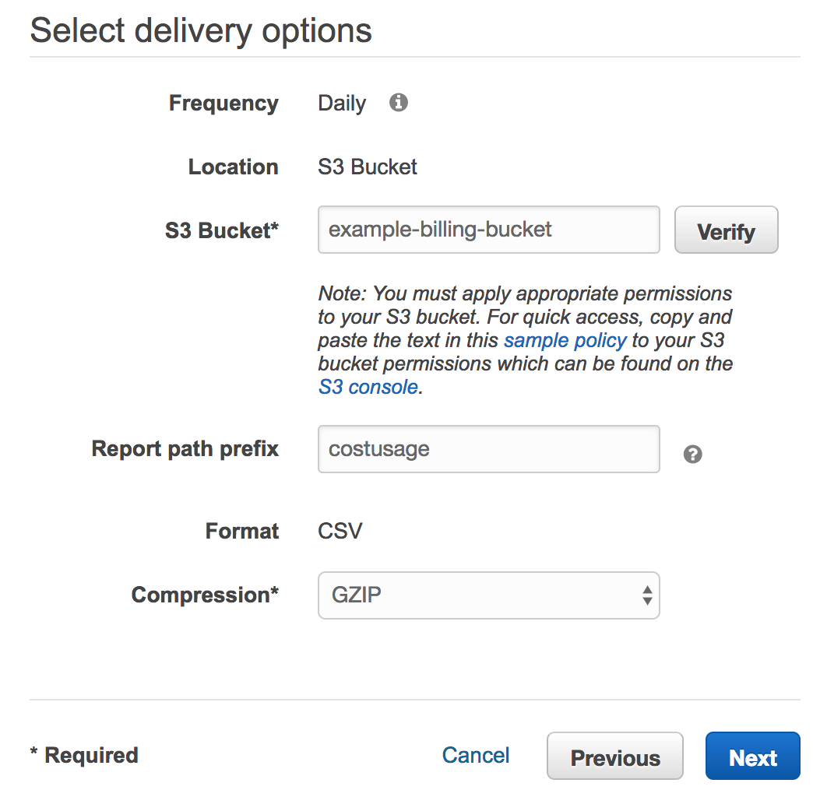
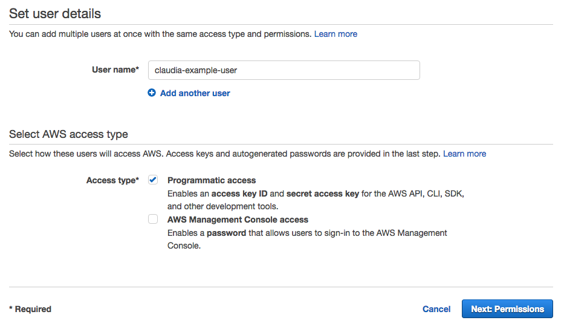
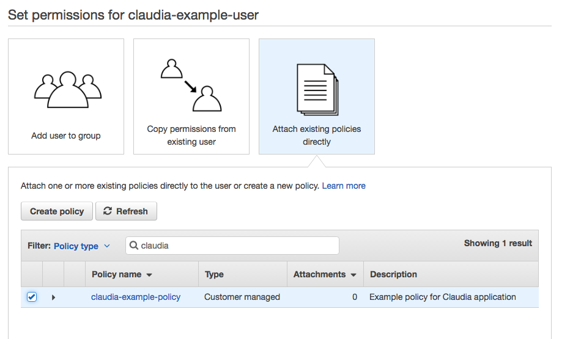
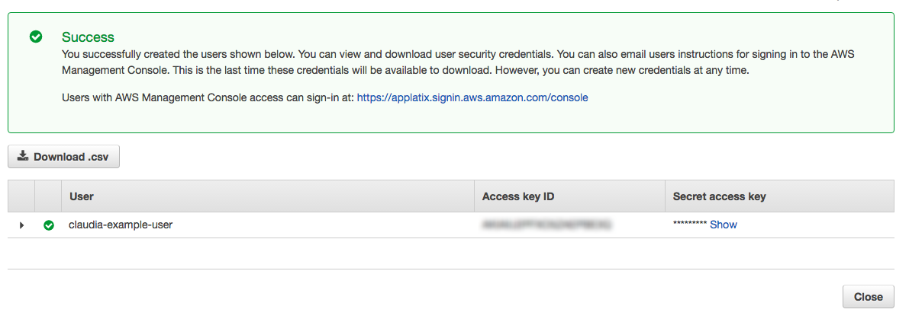
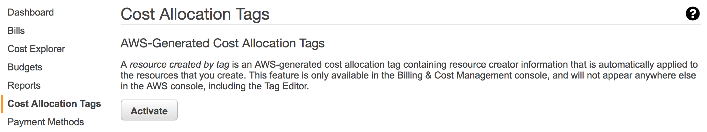
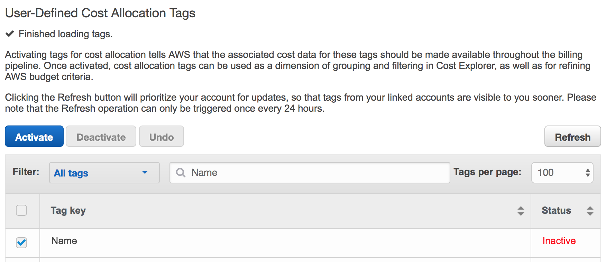

# Setting Up AWS for Claudia

This document guides you through the process of enabling AWS Cost & Usage reports
for delivery to your S3 bucket, and creating the access credentials and policy
so Claudia can access the report data.

When you complete these steps, go to
[Claudia setup](claudia) to configure your application.

### Step 1 Configure Destination S3 Bucket


* Create a new bucket (or select an existing one). AWS lets you upload Cost & Usage reports to an S3 bucket of your choice.

* Attach the following policy, which gives Amazon permissions to write to the bucket (NOTE: Replace `example-billing-bucket` with the actual name of your bucket).

```
	{
	  "Version": "2008-10-17",
	  "Id": "Policy1335892530063",
	  "Statement": [
	    {
	      "Sid": "Stmt1335892150622",
	      "Effect": "Allow",
	      "Principal": {
	        "AWS": "arn:aws:iam::386209384616:root"
	      },
	      "Action": [
	        "s3:GetBucketAcl",
	        "s3:GetBucketPolicy"
	      ],
	      "Resource": "arn:aws:s3:::example-billing-bucket"
	    },
	    {
	      "Sid": "Stmt1335892526596",
	      "Effect": "Allow",
	      "Principal": {
	        "AWS": "arn:aws:iam::386209384616:root"
	      },
	      "Action": [
	        "s3:PutObject"
	      ],
	      "Resource": "arn:aws:s3:::example-billing-bucket/*"
	    }
	  ]
	}
	
```

### Step 2 Enable Cost and Usage Reports


* Log in with your AWS payer account and visit the [Reports](https://console.aws.amazon.com/billing/home#/reports) section from billing management. 

* Click "Create Report".

 > 

*  On the next screen choose a report name, select the "hourly" time unit, and check the box to include resource IDs.

 > 

*  On the last screen, configure this information: 1) Enter the S3 bucket name you configured in [Step 1](#1-configure-destination-bucket), 2) Enter a non-empty value for the report path prefix, and 3) Enable the GZIP compression option.

 > 
 
* Click Next. 

After enabling the report for the first time, it will take up to 24 hours before the first report is delivered. AWS delivers new reports at least once a day.

### Step 3 Create Policy for Claudia

* Navigate to the [Policies](https://console.aws.amazon.com/iam/home#/policies) page under Identity and Access Management (IAM).

* Create the following policy that grants read-only access to the billing bucket configured in [Step 1](#1-configure-destination-bucket),
as well other permissions needed by the application (NOTE: Replace `example-billing-bucket` with the actual bucket name).

```
{
    "Version": "2012-10-17",
    "Statement": [
        {
            "Effect": "Allow",
            "Action": [
                "s3:ListBucket",
                "s3:GetObject"
            ],
            "Resource": [
                "arn:aws:s3:::example-billing-bucket",
                "arn:aws:s3:::example-billing-bucket/*"
            ]
        },
        {
            "Effect": "Allow",
            "Action": [
                "ec2:DescribeImages"
            ],
            "Resource": [
                "*"
            ]
        }
    ]
}
```

### Step 4 Create Claudia User & Access Credentials

* Navigate to the IAM [Users](https://console.aws.amazon.com/iam/home#/users) section.
* Create a new user by entering a User name and check the box to enable "Programmatic access."

 > 

* On the next screen, attach the policy that was created in [Step 3](#3-create-policy-for-claudia).

 > 

* After creating the user, you must download the AWS Access Key ID and Secret Access Key for programmatic access. NOTE: Please copy this information as AWS only displays it once. You need to input these credentials to access your application. 

 > 

### Step 5 Enable Cost Allocation Tags (Optional)

AWS allows you to enable resource tags to appear in your Cost & Usage reports as additional columns in the report. Claudia automatically detects these tags and enables additional dimensions in the UI to group or filter by. 

To enable resource tags in your billing report, go to the "Cost Allocation Tags" section in billing managment. Under this section, AWS provides an useful `createdBy` tag to track the creator of various resources. You can activate this tag with one click:

 > 

You can also enable your own, user-defined cost allocation tags as shown below:

> 
