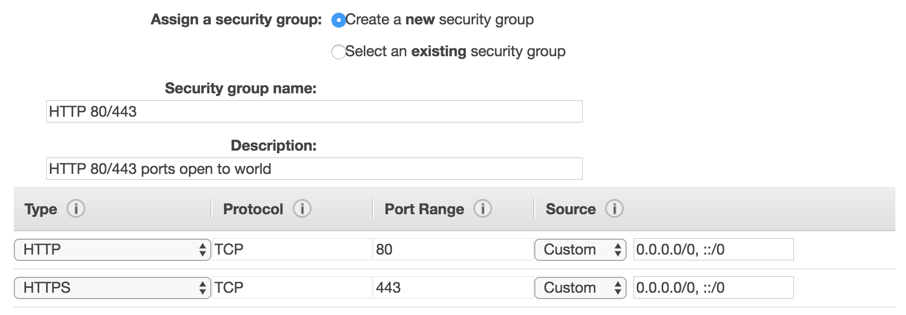
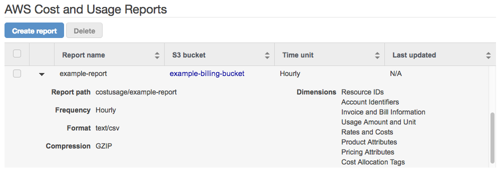
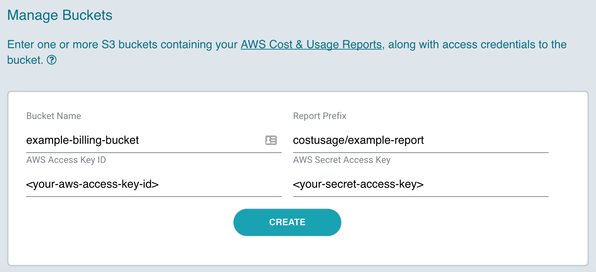
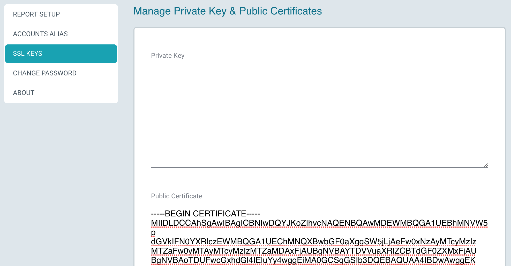
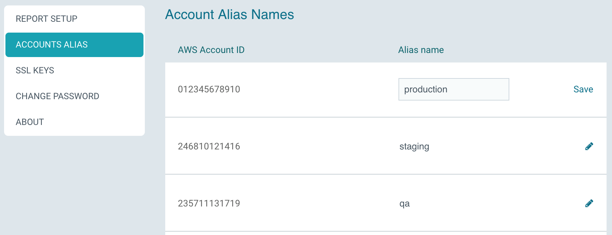

# Setting Up Claudia

Before you set up Claudia, make sure you have completed the [AWS Setup](aws/) steps for enabling AWS Cost & Usage Reports, and creating the required AWS credentials to access the S3 bucket.

### Step 1: Launch the AMI from AWS

* Visit the Claudia AWS marketplace page at [https://aws.amazon.com/marketplace/pp/B06XVZ9VS9](https://aws.amazon.com/marketplace/pp/B06XVZ9VS9). From there, follow instructions to launch the instance into your account.

* Choose an instance type with at least 8 GB of memory (such as t2.large, m4.large, or m3.large).

* Attach a security group for enabling HTTP access (ports 80 & 443) to the instance.  The screenshot below shows a sample security group configuration.

   > 

* Launch the AMI.

* Browse to the public IP address of the instance.

* **Login with the username `admin` and the EC2 instance ID as the password.** Applatix recommends changing the password from its default value after the initial login.

### Step 2: Configure Report Buckets

* From the AWS billing dashboard, go to the [Reports](https://console.aws.amazon.com/billing/home#/reports) section, and expand the cost and usage report you created in [AWS Setup Step 2](aws/#2-enable-cost-and-usage-reports).
* Make a note of the S3 bucket name and the "Report path." You will use this information when setting up Claudia. In the sample screenshot below, the S3 bucket name is `example-billing-bucket` and the Report path is `costusage/example-report`.

  > 

* From Claudia, navigate to the "Report Setup" page and create a report.

* After the report displays, click "Add Bucket."

* Enter the following information that you just accessed from AWS Step 2:
  * S3 bucket name and the Report path 
  * Access credentials that you created in [AWS Setup Step 4](aws/#4-create-claudia-user-access-credentials).

   > 

* Click Create.

Once the bucket has been added, Claudia will immediately begin processing the report data in the bucket.

You should start seeing data arriving in the Claudia report within a minute. The processing step takes about 5 minutes for each month's worth of data.

### Step 3: Configuring DNS and SSL Certificate (recommended)

Using AWS Route 53 or another DNS service, add a DNS record that points to the public IP address of the instance.

Out-of-the box, Claudia uses a self-signed certificate that was generated on the initial launch of the instance. However, after you configure the instance with a DNS name, Applatix recommends obtaining a valid SSL certificate. This results in stronger security and better browser performance through browser caching.

In Claudia, you can enter the private key and public certificate information in the "SSL Keys" section from the setup screens:

  > 

### Step 4: Creating Account Aliases

As the AWS Cost & Usage reports are processed, Claudia automatically detects the AWS Account IDs that the reports contain. The Account Alias Names screen allows you to create alias names for these account IDs with friendlier human-readable names.

> 
